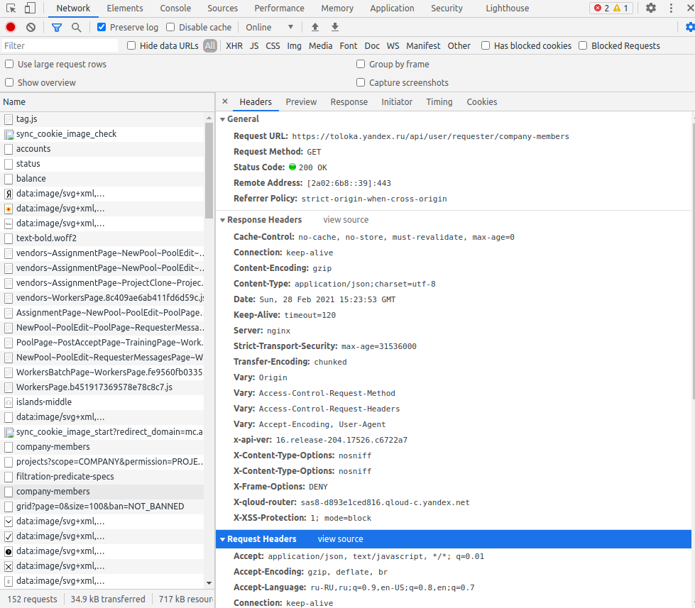

# Yandex Toloka parser

This script parse the yandex toloka via private API. If you want to use this script, you need goes to your personal 
cabinet and extract headers. You must press **F12** in chrome browser and you need to go to tab **Network**.  After 
that, you need to find next request:

    https://toloka.yandex.ru/api/user/requester/company-members

and find the **Request headers** section:

Now, you must extract all **Cookies** and **Accept**. Example of cookies:

    Accept: application/json
    Cookies: Session_id=0:1234567890.1.2.3456789012345:ABc0bQ:2a.1|19239.0.2|123912.1258.askdkaskd-askdka; sessionid2=3:123123.5.0.12312:WEb8bQ:2a.1|12512.0.2|123125.123456.akskdkakzkxc_129; yandex_login=login; i=TRS6rdASKCkzkxkcas9122MYi/M5omQqAKC9129kAKSKDkzkxkckawiehghhea0cg+h/hASDWl+2XNOASDY=; i=ASKD1b+7OASKDKKAKSKDsw/lASKDKAKSDkmDQmZY70C+TylLUASKDKZXCfXX4/4QKWEKKkT06jETZo=; is_gdpr=0; is_gdpr_b=CO73CRC/GSgC; yandexuid=124912319259123; JSESSIONID=node01293912419294.node0

You must to set headers.json like this:

    {
      "Accept": "",
      "Cookie": ""
    }
    
Now, you can to use [parse_info](parse_info.py) and [parse_workers](parse_workers.py) scripts. parse_workers.py extracts 
all info about workers and save it into file. After that, you can run parse_info.py. This script extracts all info about 
each worker and save it to file. Before extract, scripts checks if file exists. It needs to restart script from the same 
point

# Installation

    pip install -r requirements